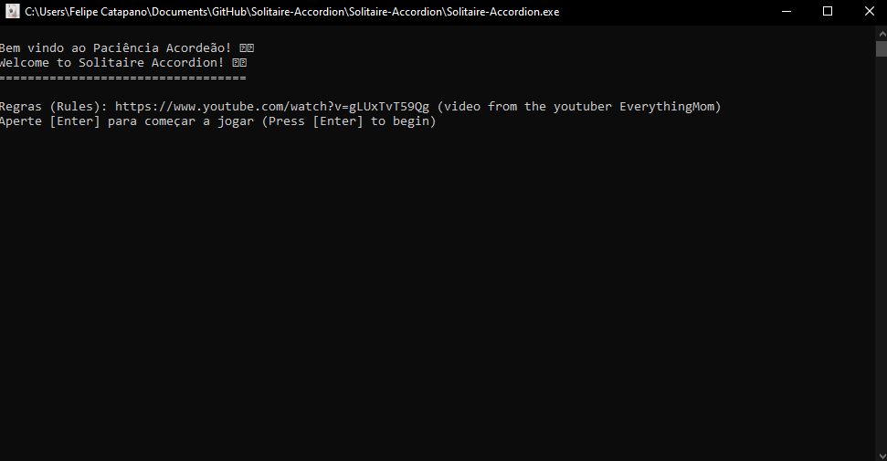
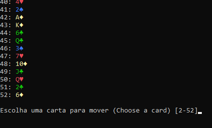

# Solitaire-Accordion
Terminal-based Python Solitaire game, developed in pairs for the Software Design course at Insper

**How to Run:**

- Windows Users --> Solitaire-Accordion/Solitaire-Accordion.exe
- Non-windows users or Python testers --> PYTHON PURO/Solitaire-Accordion.py (Requires Python3)

